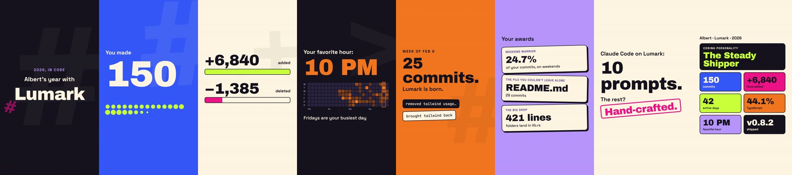
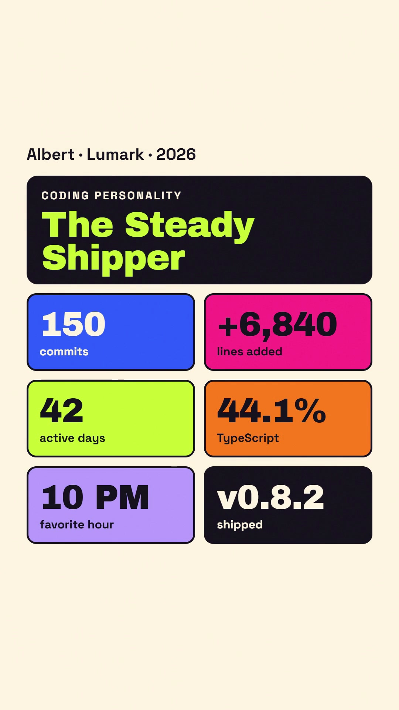

# /shipped

<a href="examples/lumark/lumark.mp4"></a>

**Your year in code, as a 40-second vertical video.**

`/shipped` is a Claude Code plugin. It reads your local git history (one repo or every repo on your machine), finds the story of your year, and renders a 9:16 recap video with [HyperFrames](https://github.com/heygen-com/hyperframes). It covers your biggest week, your habits, three awards and a coding persona. You can also include stats from your Claude Code and Codex sessions.

```
/shipped
```

Everything runs locally, so private and work repos are fine. Every number on screen comes from your git history; the agent writes the jokes, but it doesn't make up facts.

**One run gives you:**

- `shipped.mp4`: 1080×1920, 30fps, 30–45s, with music and sound effects
- `shipped.jpg`: the poster frame, also baked into the video as frame 0
- `shipped-card.png`: a 1080×1350 summary card for feeds
- `share-copy.txt`: post text for X, LinkedIn and a short version

**Install** (Claude Code):

```
/plugin marketplace add AlbertArakelyan/Shipped
/plugin install shipped@shipped
```

Other agents (Codex CLI, opencode, …): `npx skills add https://github.com/AlbertArakelyan/Shipped --skill shipped`

**Needs** Node 18+, git, ffmpeg, and the HyperFrames skills (`npx skills add heygen-com/hyperframes --all`). Don't want HyperFrames? Use `/shipped-slim`, which builds the video with whatever is on your machine.

<sub>▶ The preview on the right is a GIF. Click it for the full MP4 with sound.</sub>

<br clear="right">

## Example: Lumark

A real run on [Lumark](examples/lumark/), a TypeScript + Rust project: 150 commits from its first commit in February to v0.8.2. Single repo, default tone, with the AI chapter on.

<p></p>



**Chapter by chapter:**

- `0:00` **Cold open**: "2026, in code · Albert's year with #Lumark"
- `0:02` **Origin**: First commit on Feb 12. *Two days later:* 14 commits on Valentine's Day
- `0:05` **Big number**: **150** commits, counted up as dots
- `0:08` **Lines**: **+6,840** added, **−1,385** deleted, net +5,455
- `0:12` **When you code**: 7×24 heatmap. Favorite hour **10 PM**, Fridays are the busiest day
- `0:16` **Stack**: TypeScript 44.1%, Rust 10.6%, CSS 5.9%, JS 4.3%, "plus 2,581 lines of Markdown. Fitting."
- `0:20` **The moment**: Week of Feb 9: 25 commits, "Lumark is born," quoting *removed tailwind usage…* and *brought tailwind back*
- `0:24` **Awards**: Weekend Warrior (24.7%) · The File You Couldn't Leave Alone (README.md, 29 commits) · The Big Drop (421 lines into `lib.rs`)
- `0:28` **AI pair**: "Claude Code on Lumark: 10 prompts. The rest? *Hand-crafted.*"
- `0:32` **Persona**: The Steady Shipper, "No drama. Just a year of good work, shipped. All the way to v0.8.2"
- `0:36` **Summary**: the share card on the right

A few things this run shows:

- **It reads the commits, not just the counts.** "Lumark is born" and the Tailwind back-and-forth came from the busiest week's commit messages.
- **It reframes small numbers instead of hiding them.** Ten AI prompts became a punchline rather than a weak stat.
- **The persona follows rules.** No habit hit its threshold, so Lumark got the fallback, *The Steady Shipper*. The closing line and the version badges come from the repo's own version-bump commits.

<br clear="right">

## Usage

```
/shipped                     # this repo, this year
/shipped --all --ai          # every repo on the machine + the AI chapter
/shipped --year 2025 --tone roast
```

Plain language works as well: *"wrap up my whole year across all my repos, roast me a little, square format."*

| Option | Values | Default |
|---|---|---|
| scope | current repo · `--all` (every repo under `~`, depth 4) · `--roots <dir,dir>` | current repo |
| `--year` | `2026`, or `--since YYYY-MM-DD --until YYYY-MM-DD` | this year to date |
| `--ai` / `--no-ai` | include Claude Code / Codex stats | asks once |
| `--author` | extra commit emails, comma-separated | git `user.email` + other emails under your `user.name` |
| `--format` | `vertical` 1080×1920 · `square` 1080×1080 · `landscape` 1920×1080 | `vertical` |
| `--duration` | seconds | 30–45, chosen from your data |
| `--tone` | `default` · `hype` · `deadpan` · `roast` · `cinematic` · `retro` · freeform | `default` |
| `--anon` | hide repo names, file paths and emails | off |
| `--name` | name on the title card | git `user.name` |
| `--no-music` · `--no-sfx` · `--voice` | audio switches; `--voice` adds Kokoro narration | music + SFX, no voice |
| `--full` | on Opus 5.5, use the full workflow instead of handing off to `/shipped-slim` | — |

Output goes to `shipped-output/` in the current directory. If that folder already exists, it uses `shipped-output-<timestamp>/` instead.

## How it works

```
 collect-git.mjs ─┐                     ┌─ shipped-plan.md ──┐
                  ├─► stats.json ─► ✋ ─┤                    ├─► HyperFrames ─► shipped.mp4
 collect-ai.mjs ──┘   ai-stats.json     └─ composition-brief ┘                  shipped-card.png
                                     privacy                                     share-copy.txt
                                     review
```

1. **Collect.** Two small Node scripts with no dependencies read your git history and (optionally) your agent session logs and write JSON. **Gate:** you approve a short summary of what could appear on screen.
2. **Story.** The agent reads the three busiest weeks' commit subjects, plus `git show --stat` on one or two big commits, to work out what actually happened. It then picks 6–9 chapters, 3 awards and a persona, and writes a storyboard. **Gate:** a fact sheet maps every on-screen number to its JSON path.
3. **Compose.** A brief goes to the HyperFrames skills, which build the composition and the share card. Music is fetched at run time and sound effects come from the bundled set. Big moments land on the beat. **Gate:** `npx hyperframes check` passes with zero errors.
4. **Deliver.** It renders the video, picks a settled poster frame and bakes it in as frame 0, exports the card, writes the post text, then checks the rendered frames against the fact sheet.

The skill owns the data, the story, the copy and the look. HyperFrames owns the composition, the timing mechanics and the render.

## What it measures

<details>
<summary><b>Git</b> (<code>stats.json</code>)</summary>

| Field | Notes |
|---|---|
| commits, lines added/deleted, net, files touched, active days | merges, lockfiles, vendored/build/generated files and binaries are excluded |
| longest streak, longest break, busiest day | consecutive calendar days |
| peak hour / weekday / month, 7×24 heatmap | in the author's local time, taken from each commit's own timezone offset |
| late-night % (00–05), early-bird % (05–08), weekend % | share of commits |
| languages | by lines changed. Markdown/JSON/YAML are counted but can't be "top language" |
| top repos, most-committed file, most-churned file | |
| biggest commit | ranked by *code* lines, so a dumped data file doesn't win |
| commit-message habits | counts of `fix`, `wip`, `revert`, `typo`, conventional commits, top words (ticket IDs removed), a funny-message shortlist |
| moments | the 3 busiest weeks with their subjects: the raw material for the story |

Commits are de-duplicated by hash, so forks and second clones aren't counted twice. Everyone else's commits are ignored.
</details>

<details>
<summary><b>AI sessions</b> (<code>ai-stats.json</code>, opt-in)</summary>

| Field | Notes |
|---|---|
| sessions, human prompts, tool calls, assistant messages | Claude Code (`~/.claude/projects`) and Codex (`~/.codex/sessions`) |
| active hours, active days, longest sitting | a sitting ends after a 15-minute idle gap |
| tokens | input, output, cache read/write |
| top models, tools, slash commands, projects | names only |
| prompt heatmap, peak hour, streak | machine local time |

It never copies prompt text, response text or tool output. The parser tolerates format changes between versions by skipping lines it doesn't recognize.
</details>

## Personas

The climax of every recap. The first matching rule wins:

| Persona | Rule |
|---|---|
| The Claude Whisperer | ≥ 500 AI prompts and ≥ 40 active AI hours |
| The Midnight Refactorer | ≥ 15% of commits between 00:00 and 05:00 |
| The Weekend Warrior | ≥ 30% of commits on weekends |
| The Early Bird | ≥ 15% of commits between 05:00 and 08:00 |
| The Marathoner | a streak of ≥ 30 days |
| The Marie Kondo | deleted ≥ 60% of what was added |
| The Professional Fixer | "fix" in ≥ 25% of commit messages |
| The Polyglot | ≥ 5 code languages at ≥ 3% each |
| The Ship-It Sprinter | ≥ 25 commits in a day or ≥ 60 in a week |
| The Big-Bang Builder | a single commit with ≥ 3,000 code lines |
| The Architect | ≥ 6 active repos |
| The Steady Shipper | everyone else |

## Privacy

- Nothing is uploaded. Collecting, composing and rendering all happen on your machine. The only network traffic is fetching music (skip it with `--no-music`), web fonts and the HyperFrames tooling itself; none of your data goes out.
- Before anything is designed, you see what could appear on screen (period, masked emails, headline numbers, repo names, commit messages it might quote, AI totals) and can cut any of it.
- `--anon` replaces repo names with *Project A, B, …*, hides file paths and emails, and redacts repo-name words from commit messages, including CamelCase names like `FooButton`.
- The video never shows emails, prompt text or file contents.

## Repository layout

```
.claude-plugin/        plugin.json, marketplace.json (Claude Code)
.codex-plugin/         plugin.json (Codex)
plugin.json            agent-plugins.org manifest
skills/shipped/
  SKILL.md             entry point: options, steps, gates, ground rules
  slim.md              copy of shipped-slim, used for the Opus 5.5 hand-off
  references/          step-1-collect · step-2-story · step-3-compose · step-4-deliver
                       personas · tones · audio
  scripts/             collect-git.mjs · collect-ai.mjs · lib/
  assets/sfx/          38 CC0 sounds + sfx-analysis.md/json
skills/shipped-slim/   single-file version, no HyperFrames needed
examples/lumark/       the run shown above
scripts/               check-skills.mjs (CI checks) · link-skills.mjs
```

## Development

```bash
node scripts/check-skills.mjs        # frontmatter, links, manifest versions, slim copy, collector smoke test
node scripts/link-skills.mjs         # (re)create .claude/.agents/.opencode skill links
claude --plugin-dir .                # load the plugin locally, then run /shipped

# run the collectors on their own
node skills/shipped/scripts/collect-git.mjs --all --year 2026 --out /tmp/stats.json
node skills/shipped/scripts/collect-ai.mjs --year 2026 --out /tmp/ai-stats.json
```

After editing `skills/shipped-slim/SKILL.md`, copy it over `skills/shipped/slim.md`. The check script fails if the two differ.

## Credits

- Sound effects by [Kenney](https://kenney.nl/) (CC0). SFX analysis adapted from [/brag](https://github.com/latent-spaces/brag) (MIT), which also inspired this project's structure.
- Rendering by [HyperFrames](https://github.com/heygen-com/hyperframes).

## License

MIT
